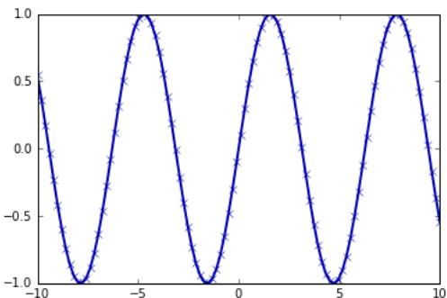
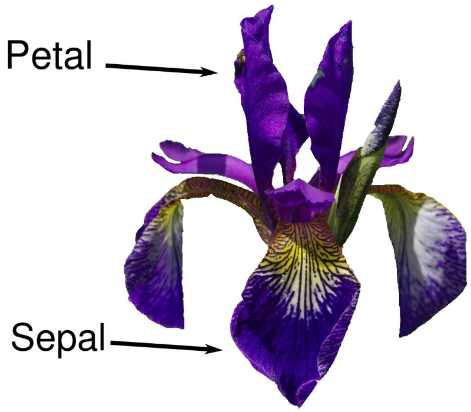

scenes. The scikit-learn project is constantly being developed and improved, and it has a very active user community. It contains a number of state-of-the-art machine learning algorithms, as well as comprehensive documentation about each algorithm. scikit-learn is a very popular tool, and the most prominent Python library for machine learning. It is widely used in industry and academia, and a wealth of tutori‐ als and code snippets are available online. scikit-learn works well with a number of other scientific Python tools, which we will discuss later in this chapter.

While reading this, we recommend that you also browse the scikit-learn user guide and API documentation for additional details on and many more options for each algorithm. The online documentation is very thorough, and this book will provide you with all the prerequisites in machine learning to understand it in detail.

# Installing scikit-learn

scikit-learn depends on two other Python packages, NumPy and SciPy. For plot‐ ting and interactive development, you should also install matplotlib, IPython, and the Jupyter Notebook. We recommend using one of the following prepackaged Python distributions, which will provide the necessary packages:

# Anaconda

A Python distribution made for large-scale data processing, predictive analytics, and scientific computing. Anaconda comes with NumPy, SciPy, matplotlib, pandas, IPython, Jupyter Notebook, and scikit-learn. Available on Mac OS, Windows, and Linux, it is a very convenient solution and is the one we suggest for people without an existing installation of the scientific Python packages. Ana‐ conda now also includes the commercial Intel MKL library for free. Using MKL (which is done automatically when Anaconda is installed) can give significant speed improvements for many algorithms in scikit-learn.

# Enthought Canopy

Another Python distribution for scientific computing. This comes with NumPy, SciPy, matplotlib, pandas, and IPython, but the free version does not come with scikit-learn. If you are part of an academic, degree-granting institution, you can request an academic license and get free access to the paid subscription ver‐ sion of Enthought Canopy. Enthought Canopy is available for Python 2.7.x, and works on Mac OS, Windows, and Linux.

# Python $( x , y )$

A free Python distribution for scientific computing, specifically for Windows. Python $( \mathbf { x } , \mathbf { y } )$ comes with NumPy, SciPy, matplotlib, pandas, IPython, and scikit-learn.

If you already have a Python installation set up, you can use pip to install all of these packages:

$\$ 5$ pip install numpy scipy matplotlib ipython scikit-learn pandas

# Essential Libraries and Tools

Understanding what scikit-learn is and how to use it is important, but there are a few other libraries that will enhance your experience. scikit-learn is built on top of the NumPy and SciPy scientific Python libraries. In addition to NumPy and SciPy, we will be using pandas and matplotlib. We will also introduce the Jupyter Notebook, which is a browser-based interactive programming environment. Briefly, here is what you should know about these tools in order to get the most out of scikit-learn.1

# Jupyter Notebook

The Jupyter Notebook is an interactive environment for running code in the browser. It is a great tool for exploratory data analysis and is widely used by data scientists. While the Jupyter Notebook supports many programming languages, we only need the Python support. The Jupyter Notebook makes it easy to incorporate code, text, and images, and all of this book was in fact written as a Jupyter Notebook. All of the code examples we include can be downloaded from GitHub.

# NumPy

NumPy is one of the fundamental packages for scientific computing in Python. It contains functionality for multidimensional arrays, high-level mathematical func‐ tions such as linear algebra operations and the Fourier transform, and pseudorandom number generators.

In scikit-learn, the NumPy array is the fundamental data structure. scikit-learn takes in data in the form of NumPy arrays. Any data you’re using will have to be con‐ verted to a NumPy array. The core functionality of NumPy is the ndarray class, a multidimensional ( $n$ -dimensional) array. All elements of the array must be of the same type. A NumPy array looks like this:

# In[2]:

```python
import numpy as np  
x = np.array([[1, 2, 3], [4, 5, 6]])  
print("x:\n{".format(x)) 
```

# Out[2]:

```json
x:[[123][456]] 
```

We will be using NumPy a lot in this book, and we will refer to objects of the NumPy ndarray class as “NumPy arrays” or just “arrays.”

# SciPy

SciPy is a collection of functions for scientific computing in Python. It provides, among other functionality, advanced linear algebra routines, mathematical function optimization, signal processing, special mathematical functions, and statistical distri‐ butions. scikit-learn draws from SciPy’s collection of functions for implementing its algorithms. The most important part of SciPy for us is scipy.sparse: this provides sparse matrices, which are another representation that is used for data in scikitlearn. Sparse matrices are used whenever we want to store a 2D array that contains mostly zeros:

# In[3]:

from scipy import sparse   
# Create a 2D NumPy array with a diagonal of ones, and zeros everywhere else eye $=$ np.eye(4)   
print("NumPy array:\n").format(eye))

# Out[3]:

```latex
NumPy array:  
[ \begin{bmatrix} 1. & 0. & 0. & 0. \\ 0. & 1. & 0. & 0. \\ 0. & 0. & 1. & 0. \\ 0. & 0. & 0. & 1. \end{bmatrix} ] 
```

# In[4]:

```python
Convert the NumPy array to a SciPy sparse matrix in CSR format
# Only the nonzero entries are stored
sparse_matrix = sparse.csr_matrix(eye)
print("\nSciPy sparse CSR matrix:\n").format(sparse_matrix)) 
```

# Out[4]:

```txt
SciPy sparse CSR matrix:  
(0, 0) 1.0  
(1, 1) 1.0  
(2, 2) 1.0  
(3, 3) 1.0 
```

Usually it is not possible to create dense representations of sparse data (as they would not fit into memory), so we need to create sparse representations directly. Here is a way to create the same sparse matrix as before, using the COO format:

In[5]:   
Out[5]:   
COO representation:   
```python
data = np.ones(4)  
row Indices = np.arange(4)  
col Indices = np.arange(4)  
eye_coo = sparse.coo_matrix((data, (rowIndices, colIndices)))  
print("C00 representation:\n{".format(eye_coo)) 
```

(0, 0) 1.0   
(1, 1) 1.0   
(2, 2) 1.0   
(3, 3) 1.0

More details on SciPy sparse matrices can be found in the SciPy Lecture Notes.

# matplotlib

matplotlib is the primary scientific plotting library in Python. It provides functions for making publication-quality visualizations such as line charts, histograms, scatter plots, and so on. Visualizing your data and different aspects of your analysis can give you important insights, and we will be using matplotlib for all our visualizations. When working inside the Jupyter Notebook, you can show figures directly in the browser by using the %matplotlib notebook and %matplotlib inline commands. We recommend using %matplotlib notebook, which provides an interactive envi‐ ronment (though we are using %matplotlib inline to produce this book). For example, this code produces the plot in Figure 1-1:

In[6]:   
```python
%matplotlib inline  
import matplotlib.pyplot as plt  
# Generate a sequence of numbers from -10 to 10 with 100 steps in between  
x = np.linspace(-10, 10, 100)  
# Create a second array using sine  
y = np.sin(x)  
# The plot function makes a line chart of one array against another  
plt.plot(x, y, marker="x") 
```

  
Figure 1-1. Simple line plot of the sine function using matplotlib

# pandas

pandas is a Python library for data wrangling and analysis. It is built around a data structure called the DataFrame that is modeled after the R DataFrame. Simply put, a pandas DataFrame is a table, similar to an Excel spreadsheet. pandas provides a great range of methods to modify and operate on this table; in particular, it allows SQL-like queries and joins of tables. In contrast to NumPy, which requires that all entries in an array be of the same type, pandas allows each column to have a separate type (for example, integers, dates, floating-point numbers, and strings). Another valuable tool provided by pandas is its ability to ingest from a great variety of file formats and data‐ bases, like SQL, Excel files, and comma-separated values (CSV) files. Going into detail about the functionality of pandas is out of the scope of this book. However, Python for Data Analysis by Wes McKinney (O’Reilly, 2012) provides a great guide. Here is a small example of creating a DataFrame using a dictionary:

# In[7]:

import pandas as pd   
# create a simple dataset of people   
data $=$ {'Name': ["John", "Anna", "Peter", "Linda"], 'Location': ["New York", "Paris", "Berlin", "London"], 'Age': [24, 13, 53, 33] }   
data_pandas $=$ pd.DataFrame(data)   
# IPython.display allows "pretty printing" of dataframes   
# in the Jupyter notebook   
display(data_pandas)

This produces the following output:

<table><tr><td></td><td>Age</td><td>Location</td><td>Name</td></tr><tr><td>0</td><td>24</td><td>New York</td><td>John</td></tr><tr><td>1</td><td>13</td><td>Paris</td><td>Anna</td></tr><tr><td>2</td><td>53</td><td>Berlin</td><td>Peter</td></tr><tr><td>3</td><td>33</td><td>London</td><td>Linda</td></tr></table>

There are several possible ways to query this table. For example:

# In[8]:

# Select all rows that have an age column greater than 30 display(data_pandas[data_pandas.Age > 30])

This produces the following result:

<table><tr><td></td><td>Age</td><td>Location</td><td>Name</td></tr><tr><td>2</td><td>53</td><td>Berlin</td><td>Peter</td></tr><tr><td>3</td><td>33</td><td>London</td><td>Linda</td></tr></table>

# mglearn

This book comes with accompanying code, which you can find on GitHub. The accompanying code includes not only all the examples shown in this book, but also the mglearn library. This is a library of utility functions we wrote for this book, so that we don’t clutter up our code listings with details of plotting and data loading. If you’re interested, you can look up all the functions in the repository, but the details of the mglearn module are not really important to the material in this book. If you see a call to mglearn in the code, it is usually a way to make a pretty picture quickly, or to get our hands on some interesting data.


Throughout the book we make ample use of NumPy, matplotlib and pandas. All the code will assume the following imports:

import numpy as np import matplotlib.pyplot as plt import pandas as pd import mglearn

We also assume that you will run the code in a Jupyter Notebook with the %matplotlib notebook or %matplotlib inline magic enabled to show plots. If you are not using the notebook or these magic commands, you will have to call plt.show to actually show any of the figures.

# Python 2 Versus Python 3

There are two major versions of Python that are widely used at the moment: Python 2 (more precisely, 2.7) and Python 3 (with the latest release being 3.5 at the time of writing). This sometimes leads to some confusion. Python 2 is no longer actively developed, but because Python 3 contains major changes, Python 2 code usually does not run on Python 3. If you are new to Python, or are starting a new project from scratch, we highly recommend using the latest version of Python 3 without changes. If you have a large codebase that you rely on that is written for Python 2, you are excused from upgrading for now. However, you should try to migrate to Python 3 as soon as possible. When writing any new code, it is for the most part quite easy to write code that runs under Python 2 and Python 3.2 If you don’t have to interface with legacy software, you should definitely use Python 3. All the code in this book is writ‐ ten in a way that works for both versions. However, the exact output might differ slightly under Python 2.

# Versions Used in this Book

We are using the following versions of the previously mentioned libraries in this book:

In[9]:  
```python
import sys   
print("Python version: \{\}".format(sys.version))   
import pandas as pd   
print("pandas version: \{\}".format(pd._version\_))   
import matplotlib   
print("matplotlib version: \{\}".format(matplotlib._version\_))   
import numpy as np   
print("NumPy version: \{\}".format(np._version\_))   
import scipy as sp   
print("SciPy version: \{\}".format(sp._version\_))   
import IPython   
print("IPython version: \{\}".format(IPython._version\_))   
import sklearn   
print("scikit-learn version: \{\}".format(sklearn._version\_)) 
```

# Out[9]:

```txt
Python version: 3.5.2 |Anaconda 4.1.1 (64-bit) (default, Jul 2 2016, 17:53:06)  
[GCC 4.4.7 20120313 (Red Hat 4.4.7-1)]  
pandas version: 0.18.1  
matplotlib version: 1.5.1  
NumPy version: 1.11.1  
SciPy version: 0.17.1  
IPython version: 5.1.0  
scikit-learn version: 0.18 
```

While it is not important to match these versions exactly, you should have a version of scikit-learn that is as least as recent as the one we used.

Now that we have everything set up, let’s dive into our first application of machine learning.


This book assumes that you have version 0.18 or later of scikitlearn. The model_selection module was added in 0.18, and if you use an earlier version of scikit-learn, you will need to adjust the imports from this module.

# A First Application: Classifying Iris Species

In this section, we will go through a simple machine learning application and create our first model. In the process, we will introduce some core concepts and terms.

Let’s assume that a hobby botanist is interested in distinguishing the species of some iris flowers that she has found. She has collected some measurements associated with each iris: the length and width of the petals and the length and width of the sepals, all measured in centimeters (see Figure 1-2).

She also has the measurements of some irises that have been previously identified by an expert botanist as belonging to the species setosa, versicolor, or virginica. For these measurements, she can be certain of which species each iris belongs to. Let’s assume that these are the only species our hobby botanist will encounter in the wild.

Our goal is to build a machine learning model that can learn from the measurements of these irises whose species is known, so that we can predict the species for a new iris.

  
Figure 1-2. Parts of the iris flower

Because we have measurements for which we know the correct species of iris, this is a supervised learning problem. In this problem, we want to predict one of several options (the species of iris). This is an example of a classification problem. The possi‐ ble outputs (different species of irises) are called classes. Every iris in the dataset belongs to one of three classes, so this problem is a three-class classification problem.

The desired output for a single data point (an iris) is the species of this flower. For a particular data point, the species it belongs to is called its label.

# Meet the Data

The data we will use for this example is the Iris dataset, a classical dataset in machine learning and statistics. It is included in scikit-learn in the datasets module. We can load it by calling the load_iris function:

# In[10]:

```python
from sklearn.datasets import load_iris  
iris_dataset = load_iris() 
```

The iris object that is returned by load_iris is a Bunch object, which is very similar to a dictionary. It contains keys and values:

# In[11]:

print("Keys of iris_dataset: \n{}".format(iris_dataset.keys()))

# Out[11]:

Keys of iris_dataset: dict_keys(['target_names', 'feature_names', 'DESCR', 'data', 'target'])

The value of the key DESCR is a short description of the dataset. We show the begin‐ ning of the description here (feel free to look up the rest yourself):

# In[12]:

print(iris_dataset['DESCR'][:193] + "\n...")

# Out[12]:

Iris Plants Database

Notes

Data Set Characteristics: :Number of Instances: 150 (50 in each of three classes) :Number of Attributes: 4 numeric, predictive att

The value of the key target_names is an array of strings, containing the species of flower that we want to predict:

# In[13]:

print("Target names: {}".format(iris_dataset['target_names']))

# Out[13]:

Target names: ['setosa' 'versicolor' 'virginica']

The value of feature_names is a list of strings, giving the description of each feature:

# In[14]:

print("Feature names: \n{}".format(iris_dataset['feature_names']))

# Out[14]:

Feature names: ['sepal length (cm)', 'sepal width (cm)', 'petal length (cm)', 'petal width (cm)']

The data itself is contained in the target and data fields. data contains the numeric measurements of sepal length, sepal width, petal length, and petal width in a NumPy array:

# In[15]:

print("Type of data: {}".format(type(iris_dataset['data'])))

# Out[15]:

Type of data: <class 'numpy.ndarray'>

The rows in the data array correspond to flowers, while the columns represent the four measurements that were taken for each flower:

# In[16]:

print("Shape of data: {}".format(iris_dataset['data'].shape))

# Out[16]:

Shape of data: (150, 4)

We see that the array contains measurements for 150 different flowers. Remember that the individual items are called samples in machine learning, and their properties are called features. The shape of the data array is the number of samples multiplied by the number of features. This is a convention in scikit-learn, and your data will always be assumed to be in this shape. Here are the feature values for the first five samples:

# In[17]:

print("First five columns of data:\n{}".format(iris_dataset['data'][:5]))

# Out[17]:

```latex
First five columns of data:  
[ \begin{bmatrix} 5.1 & 3.5 & 1.4 & 0.2 \\ 4.9 & 3. & 1.4 & 0.2 \\ 4.7 & 3.2 & 1.3 & 0.2 \\ 4.6 & 3.1 & 1.5 & 0.2 \\ 5. & 3.6 & 1.4 & 0.2 \end{bmatrix} ] 
```

From this data, we can see that all of the first five flowers have a petal width of $0 . 2 \mathrm { c m }$ and that the first flower has the longest sepal, at $5 . 1 \mathrm { { c m } }$ .

The target array contains the species of each of the flowers that were measured, also as a NumPy array:

# In[18]:

print("Type of target: {}".format(type(iris_dataset['target'])))

# Out[18]:

Type of target: <class 'numpy.ndarray'>

target is a one-dimensional array, with one entry per flower: